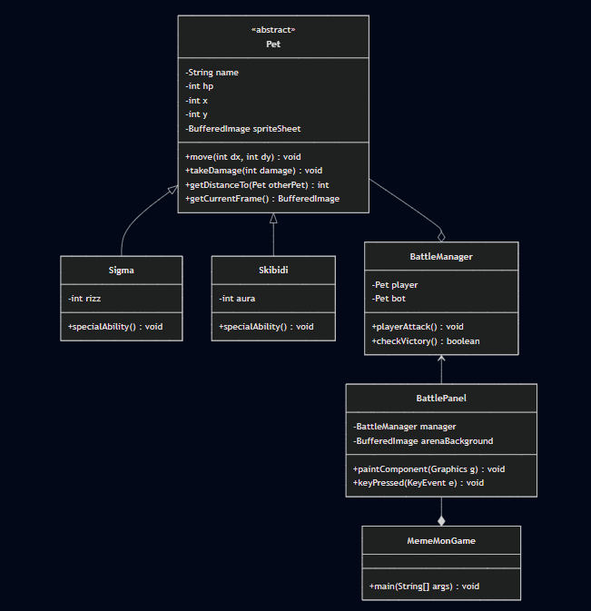
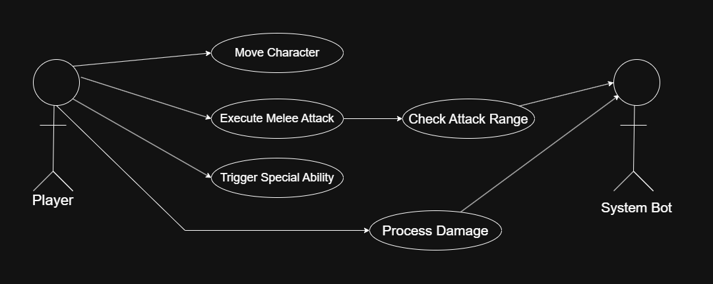

# Meme-mon: Brainrot Arena 🚀

**Meme-mon: Brainrot Arena** is a high-energy, Java-based 2D battle game featuring a 2026 "Brainrot" aesthetic. Battle through custom Aseprite animations and interactive keyboard movement! Built with core **Object-Oriented Programming (OOP)** principles, it features dynamic centering, a neon-glitch arena, and distance-based melee combat. Optimize your Aura and win the Arena!

---

## 🎮 Features
* **Dynamic Movement:** Full control of your character using Arrow Keys.
* **Melee Combat System:** Proximity-based attacking logic—you must get close to "Rizz" up the enemy.
* **OOP Architecture:** Leverages Abstraction, Encapsulation, and Polymorphism for scalable game logic.
* **Responsive UI:** Automatically scales to Full Screen/Maximized windows while keeping sprites centered.
* **Custom Graphics:** Hand-crafted sprites created in **Aseprite**.

---

## 🛠️ Controls
| Key | Action |
| :--- | :--- |
| **Arrow Keys** | Move Character (Up, Down, Left, Right) |
| **Spacebar** | Execute Melee Attack (Must be in range) |
| **Aura Button** | Trigger Special Ability |

---

## 🏗️ System Architecture
The project is designed with a strict adherence to OOP concepts:
* **`Pet.java` (Abstraction):** An abstract base class defining the properties and behaviors (HP, stats, movement) of all combatants.
* **`BattleManager.java` (Encapsulation):** Manages the game state, turn logic, and damage calculations.
* **`BattlePanel.java` (Graphics/Events):** Handles rendering, the `KeyListener` for movement, and the Arena background.


### Class Diagram  



### Use Case Diagram


---

## 🚀 Getting Started

### Prerequisites
* **Java JDK 17** or higher.s
* IDE (IntelliJ IDEA, Eclipse, or NetBeans).

### Installation
1. Clone the repository:
   ```bash
   git clone [https://github.com/yourusername/MemeMon-Brainrot-Arena.git](https://github.com/yourusername/MemeMon-Brainrot-Arena.git)
2. Ensure your sprite sheets (sigma_sheet.png, skibidi_sheet.png) and arena.png are in the root directory.

3. Compile and run MemeMonGame.java.
